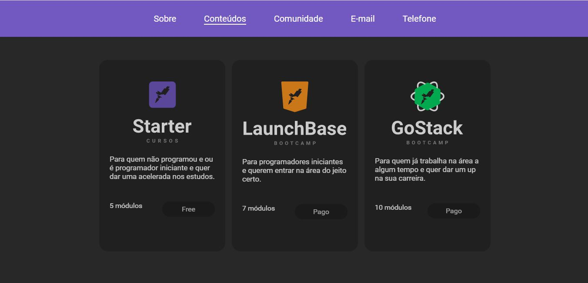
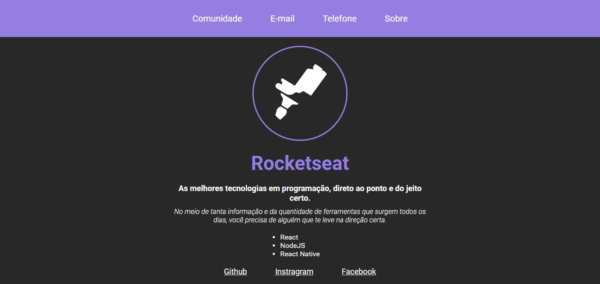

<h1 align="center">
    
</h1>

## Objetivo

O objetivo deste respositório é guardar os desafios e outros exercícios do LauchBase da Rocketseat. A descrição de cada desafio está comentada em cada arquivo Javascript.

## Destaques

### Desafio 2-3
Fanalizo hoje o último desafio do módulo 2. Resumindo, este desafio constistiu em continuar o desafio anterior aplicando conceitos HTML e CSS e agora também Javascript. O Javascript foi usado para criar uma tela de modal para exibir informações de cada curso da Rockeseat (starter, launchbase gostack) ao clicar no respectivo curso.

<h1 align="center">
    
</h1>

### Desafio 2-2
Até o momento o destaque fica por conta do desafio 2-2, que apresenta uma página **Sobre** com informações da Rocketseat. O objetivo do desafio é exercitar o HTML e o CSS.

<h1 align="center">
    
</h1>

## Licença

Este repositório está sob a licença MIT. Veja o arquivo [LICENSE](/LICENSE) para mais informações. 

